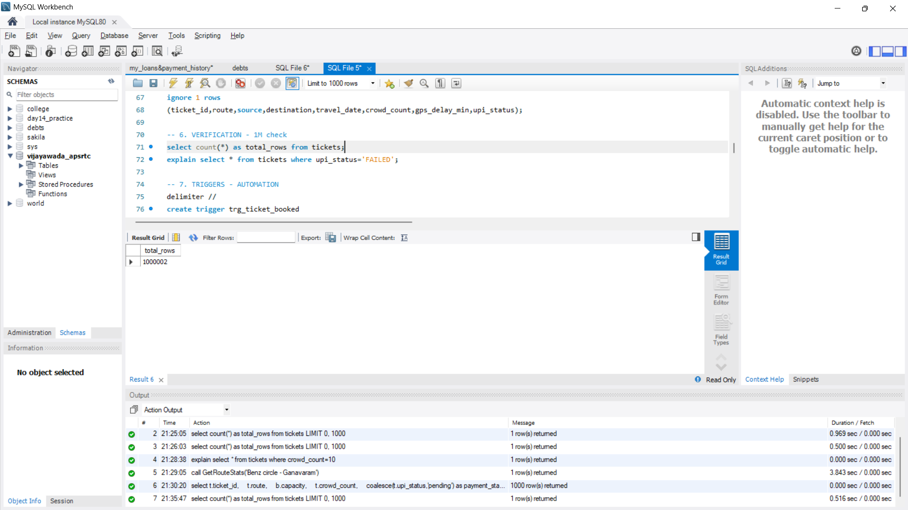
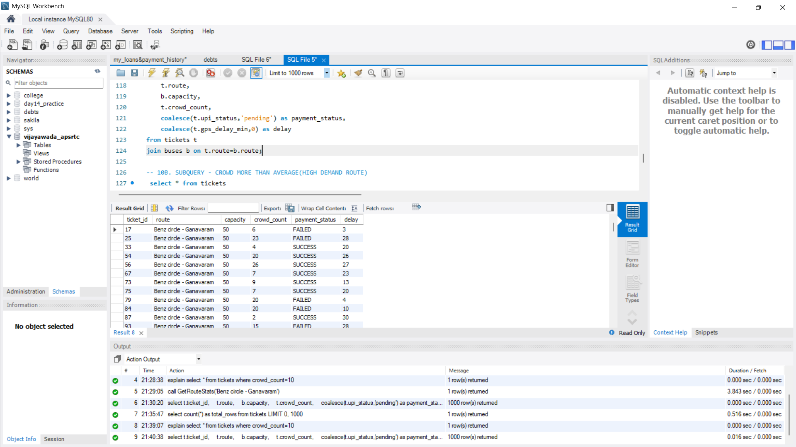
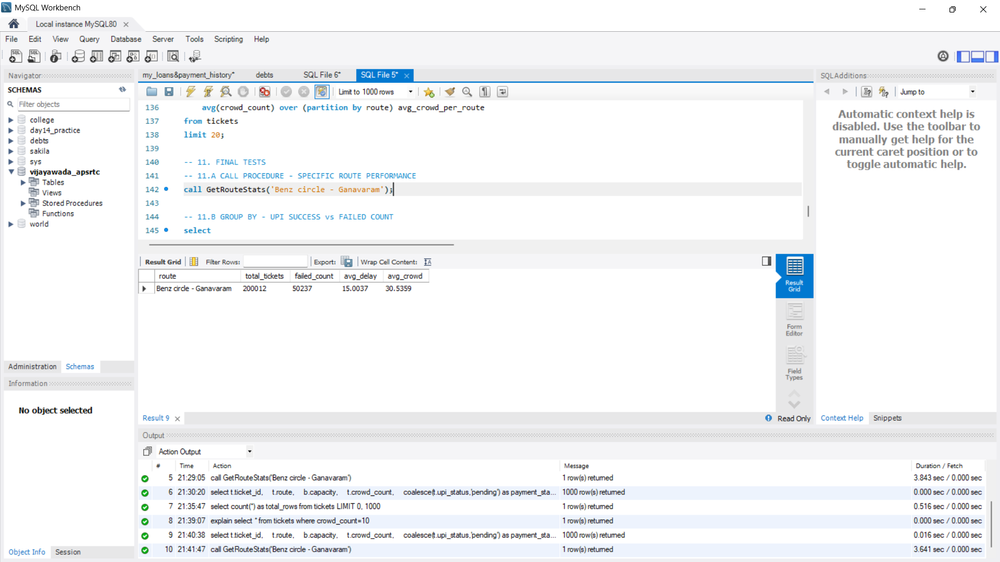

# Vijayawada APSRTC Smart Transit & UPI Pipeline - 1M Rows MySQL Project

Vijayawada city buses (PNBS, Benz Circle, Gannavaram,bhimavaram,Hyderabad,) UPI ticketing simulation.

**What I Did:**
- 1M rows ETL with Python + LOAD DATA
- Partitioning by crowd_count (3 partitions)
- 2 Triggers - Booking audit & UPI fail log
- Transaction - Safe ticket booking
- Procedure - GetRouteStats()
- Analytics - JOIN, Subquery, RANK() Window Function

**Tables:** buses, tickets, ticket_audit, failed_logs
**Stack:** MySQL 8.0

**Run:** Create Tables -> Load CSV -> Create Triggers -> Run Queries

## Screenshots

